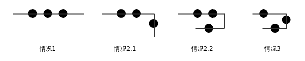

## A. Elephant
### 题目大意
在数轴上从0点走到整数点x点，每步可以走1,2,3,4,5格，问最少需要走多少步。
### 数据范围
1 <= x <= 1000,000
### 思路
ans = (x + 4) / 5

## B. Chocolate
### 题目大意
一个长为n的数列a仅有0和1组成，现将其分割成若干段，使每段有且仅有一个1，问有多少种分割方式。
### 数据范围
1 <= n <= 100
### 思路
将a的首尾各添加一个1，统计每相邻两个1之间的0的个数c[i]，c[i]+1的累乘即是答案。
时间复杂度O(n)
### 注
在最坏情况下答案可能达到2^50，需要64位整数

## C. Waterring Flowers
### 题目大意
给定平面n个点，以及2个特殊点，以2个特殊点为圆心画圆，半径分别为R1，R2，求最小的R1^2+R2^2，使2个圆覆盖给定的所有点。
### 数据范围
1 <= n <= 2000
所有坐标均为整数，且满足-10^7 <= x, y <= 10^7
### 思路
显然，R1，R2分别等于离两个特殊点最远的点与其之间的距离。
枚举距点1最远的点，即可得R1；再扫一遍所有点，没有被点1覆盖到的点就必须由点2覆盖，由此更新R2的值。
时间复杂度O(n^2)
### 注
R1^2+R2^2需要64位整数

##D. Polyline
### 题目大意
给定平面上3个点，用一条每一段都平行于x轴或y轴的折线来穿过这3个点。问满足条件的折线最少包含几段。
### 数据范围
所有坐标均为整数，且满足-10^9 <= x, y <= 10^9
### 思路
1. 当3点的x坐标或y坐标相同时，只需一条线段即可穿过3点；
2. 当2点的x坐标或y坐标相同时，需讨论（方便期间设这2点相同的坐标为y）：
    1. 当第3点的y坐标位于前2点同侧或与其中一点相同时，需2条线段；
    2. 当第3点的y坐标位于前2点之间时，需3条线段；
3. 当每个点的x坐标和y坐标都不同时，需要3段线段。



## E. XOR and Favorite Number
### 题目大意
给定整数k和数列a[n]，回答m个询问：每个询问包含2个整数l, r，回答满足下列条件的的(i, j)的个数。(数列a从1开始编号）
* l <= i <= j <= r
* a[i] xor a[i+1] xor ... xor a[j-1] xor a[j] == k

### 数据范围
1 <= n, m <=10^5
0 <= k <= 10^6
### 思路
设f(x) = a[1] xor a[2] xor ... xor a[x]，则a[i] xor a[i+1] xor ... xor a[j-1] xor a[j] = f[i] - f[j-1]

考虑这样一个算法：
维护一个区间[L,R]，同时维护
* 计数数组cnt[p]，表示[**L-1**, R]中f[i-1]=p的个数；
* ansnow，表示在[L, R]上满足题设要求的(i, j)的个数。

则
* 以L-1为左端点，以[L, R]任意位置为右端点，满足题设要求的(i, j)的个数为cnt[f[L-2] ^ k]
* 以[L, R]中任意位置为左端点，R+1为右端点的满足题设要求的(i, j)的个数为cnt[f[R+1] ^ k]

初始令L=1, R=0, cnt[0]=1, nowans=0。
根据每个询问的[l, r]，调整L, R的位置，每次使L或R加减1，同时更新cnt和ansnow：
```c++
while (l < L) { --L; nowans += cnt[f[L-1] ^ k]; ++cnt[f[L-1]]; }
while (L < l) { --cnt[f[L-1]]; nowans -= cnt[f[L-1] ^ k]; ++L; }
while (R < r) { ++R; nowans +=cnt[f[R] ^ k]; ++cnt[f[R]]; }
while (r < R) { --cnt[f[R]]; nowans-=cnt[f[R] ^ k]; --R; }
```
但是这样的时间复杂度为O(n\*m)，显然太高了。

一个容易想到的优化是：把询问按某一端点排序，如右端点，这样R就只增不减，对所有右端点的处理的总的时间复杂度只有O(n)。然而这并没有什么卵用，因为处理左端点的时间复杂度仍然是O(n\*m)。

这样的时间复杂度实在令人不爽：左端点处理的太慢，必然导致TLE；同时，与程序的效率瓶颈相比，右端点处理的又太快了，这样的高效并不能给我没带来什么好处。我们希望能找到一种方法，让左边快一点，同时可以忍受右边慢一点。

考虑把数列a每W个分一组，并以此将m个询问按其左端点的位置分组。对于每一组询问，按右端点排序，进行上述算法。
这样一来，对于每一组询问，右端点最多共需移动n次，共n/W组，时间复杂度为O(n\*n/W)；同时对于每个询问的左端点来说，最多只需要移动W下，共m个询问，时间复杂度为O(W\*m)。
令W=sqrt(n)，这样总的时间复杂度为O((n+m)\*sqrt(n))，可以接受。
### 注
* 答案有可能是64位整数。
* 虽然k的范围最大是10^6，但异或后最大可以达到2^20-1，cnt要开够大小。
* 对涉及区间维护的问题来说，**左右端点开闭**、**变量意义**、**变量初值**、区间端点移动时变量**维护方式（顺序）**等都是很头疼的问题，一定要提前想清楚再敲代码，别依赖写代码或debug的时候再想，只会更乱。
* 算法中对L的处理均是处理L-1，可以将读入数据中的l--，代码中可以省去很多“-1”，不过这样一来上条所述的问题都要重新推算了。
