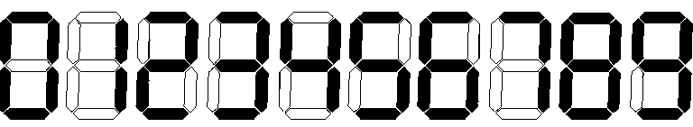

​## A. Professor GukiZ's Robot
### 题目大意
给定平面上2个点，问一个8方向可行动的机器人从一个点走到另一个点最少需要多少步
### 数据范围
-10^9 <= x, y <= 10^9
### 思路
ans = min (|x1 - x2|, |y1 - y2|)

## B.Grandfather Dovlet's calculator
### 题目大意

问用这样的方式表示[a, b]间的所有数，需要多少个小线段。
### 数据范围
1 <= a <= b <= 10^6
### 思路
暴力枚举就行了O(n\*(logn/log10))

## C. Pearls in a Row
### 题目大意
给定数列a[n]，要求将数列划分成若干段，使每段都含有2个相同的数，求分成最多段的方法。
### 数据范围
1 <= n <= 3\*10^5
1 <= a[i] <= 10^9
### 思路
贪心。从头开始找一个出现重复的子序列，作为第一段，再重复上述过程……
正确性很好证明：假设上述算法的结果不是最优的，称上述方案为A，最优方案为B，有LENB>LENA。假设第一个出现不同的是第i段的右端点R[i]，那么必有RB[i]>RA[i]，因为按照方案A，如果RB[i]<RA[i]，B不是合法解。 这时我们将RB[i]调整至与RA[i]相同，则B的第i段仍合法。于是我们在不破坏解的合法性的同时在RB[i]后面冒出一个“气泡”，同时使RB[0..i]=RA[0..i]。这个气泡加入了第i+1段，使其增长，显然i+1段也仍是合法的。重复这个过程至第LENA段，可得RB[0..LENA]=RA[0..LENA]，此时RB[LENA]=RA[LENA]=n，又LENB>LENA，导出矛盾。
由于STL的存在，不用手写个查找树了……
时间复杂度O(nloga)

## D. Professor GukiZ and Two Arrays
### 题目大意
给定2个数列a[n], b[m]，可将2个数列中的数互相交换，最多交换2次，求使v=|sum(a) - sum(b)|最小的交换方案。
### 数据范围
1 <= n, m <= 2000
-10^9 <= a[i], b[i] <= 10^9
### 思路
求v0 = sum(a) - sum(b)
可以将“交换”视作“选带权数”，其中权是这个数被选（被交换）后给v带来的改变量，a中数的权是-a[i]\*2，b中数的权是b[i]。目标是选出的数的权加在v0上得到v1，使|v1|最小。枚举交换次数进行讨论：
* 交换1次。可暴力枚举a，b分别用哪个数来交换。取最优。
* 交换2次。先找出a中拿来交换的数对，b中拿来交换的数对，并按两数权值之和排序。设排序后的权值数组分别为as,bs。
用两个指针i, j来扫描as[i], bs[j]。
其中i从0到n-1，j初始为n-1，动态调整：
当前的|as[i]+bs[j]+v0| >= |as[i]+bs[j+1]+v0|时，j--。

## E. New Year Tree
### 题目大意
给定一棵n个点的树，每个节点有一个颜色c[i]，进行m个操作：
* 将子树全部染成一个颜色
* 询问某个子树拥有的不同颜色数。

### 数据范围
1 <= n, m <= 4\*10^5
1 <= c[i] <= 60
### 思路
用树的dps序列来建立一个线段树，这样每个子树都变成了序列上的一个区间。
一棵子树的颜色可以由64位整数表示，O(1)时间即可处理颜色。
时间复杂度O(mlogn)

## F. Xors on Segments
### 题目大意
定义f(a, b) = a xor (a+1) xor ... xor (b-1) xor b。
给定数列a[n]， 进行m次询问：
对给定的l, r，求满足l <= i, j <= r的最大的f(a[i], a[j])。
### 数据范围
1 <= n <= 5\*10^4
1 <= m <= 5\*10^3
1 <= a[i] <= 10^6
### 思路
g(x) = f(0, x)
f(a, b) = g(a) xor g(b-1) = g(a) xor g(b) xor min(a, b)
为方便表示，记F(i, j) = f(min(a[i],a[j]), max(a[i],a[j]))

2种解法：

一、DP。

对于固定的i，设d[j] = max(F(i, k)) (i <= k <=j)。则
d[i] = a[i]
d[j] = max(d[j-1], g(a[i]) xor g(a[j]) xor min(a[i], a[j]) (i < j < n)
对l <= i <= r的询问，可以由d[r]来更新其答案。时间复杂度O(n*(n+m))。

二、区间划分+trie。

使用trie来存放二进制，那么要求一个新的数与已存在的数的xor的最大值就很简单：根据新数的二进制，令其每一位取反，对取反后的数看在trie中是否能走得通，存在则结果的这一位为1，从这一边走下去，否则为0，走另一边。
利用公式f(a, b) = g(a) xor g(b-1)。由于a[i]是无序的，每个点都可能是结果的左端或右端，对于某个区间，需要维护2棵trie，分别存放已经扫过的g(a[i])和g(a[i-1])，同时，为了保证解的合法性，必须对g(a[i])的trie的每个子树维护a[i]的最大值，对g(a[i-1])的trie的每棵子树维护a[i]的最小值，以保证f(a, b)中的a一定不大于b。这样，用一个新的数来询问，即可得到以这个数和trie表示的区间中的任意一数为参数的F(i, j)的值。
事实上，2棵trie可以合并成一棵，没有冲突。

将数列划分为sqrt(n)组，并将询问按其左端点进行分组，每一组按右端点排序。对于每一个询问[l, r]，设其所在组的a[i]值的范围区间为[L, R)，其最优解(p, q)可能有以下三种情况：
1. p, q均在组内，即L <= p, q < R
2. p, q均在组外，即R <= p, q
3. p, q一个在组内，一个在组外。设p < q，则L <= p < R <= q

对于情况1，对每个询问，新建一棵trie，对区间内每个数在trie中查询一下来更新答案，然后加入trie。处理每个询问的时间复杂度O(sqrt(n)*logn)，总计O(n*sqrt(n)*logn)。
对于情况2，对每**组**询问（组内已经按r排序过了），新建一棵trie，查询并插入每个数。令d[j]表示max(F(R, i))，则每个询问可根据其右端点的值用d[r]来更新。处理每组询问的时间复杂度O(n*logn)，总计O(sqrt(n)*n*logn)。
对于情况3，对于每个询问[l, r]，在情况2中的trie扫到r时，用[l, R)来询问但不将其加入trie。处理每个询问的时间复杂度O(sqrt(n)*logn)，总计O(n*sqrt(n)*logn)。

另外，对于l < R <= r的询问来说，可以用类似情况2的解法进一步优化情况1的解法（虽然对效率没有本质提升）：
对每组满足这个条件的询问，新建一个trie，从R开始往回扫，查询并插入每个数。每个询问可以在扫到其左端点时更新。

整个算法的时间复杂度为O(n*sqrt(n)*logn)。
### 注
* 区间划分的思想还是蛮重要的，是一个很巧妙的“折中”的方法。
* 10^6是20位不是19位……
